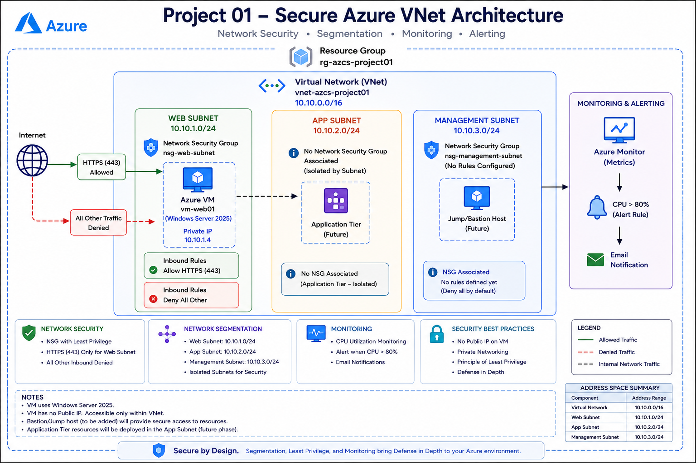

# Project 01 — Secure Azure Virtual Network

> A practical Azure Cloud Security project focused on network segmentation, access control, secure workload deployment, and basic monitoring.

---

## 📌 Project Status


| Category | Details |
|---|---|
| **Status** | Completed |
| **Platform** | Microsoft Azure |
| **Focus** | Cloud Security / Network Security |
| **Project Type** | Hands-on Home Lab |

---

## 📖 Overview

This project demonstrates the design and implementation of a segmented Azure Virtual Network with security controls for web, application, and management workloads.

The primary objective was to build a secure network foundation following core cloud security principles such as:

- Network segmentation
- Least privilege
- Attack surface reduction
- Controlled inbound access
- Private workload architecture
- Basic monitoring and detection

---

## 🎯 Objectives

- Design an Azure Virtual Network using multiple subnets
- Separate web, application, and management workloads
- Implement Network Security Groups
- Allow only required inbound traffic
- Prevent direct Internet-based administrative access
- Deploy a private Windows Server workload
- Configure basic VM monitoring
- Validate the implemented security controls
- Document the architecture and security decisions

---

## 🏗️ Architecture



### Network Architecture

```text
                         INTERNET
                            │
                            │ HTTPS : 443
                            ▼
                    ┌─────────────────┐
                    │     nsg-web     │
                    │ Allow TCP 443   │
                    └────────┬────────┘
                             │
                    ┌────────▼────────┐
                    │    snet-web     │
                    │  10.10.1.0/24   │
                    └────────┬────────┘
                             │
                    ┌────────▼────────┐
                    │ vm-web-project01│
                    │   Private IP    │
                    │   No Public IP  │
                    └─────────────────┘

              ┌─────────────────────────────────┐
              │       vnet-azcs-project01       │
              │          10.10.0.0/16           │
              │                                 │
              │  snet-app        10.10.2.0/24   │
              │                                 │
              │  snet-management 10.10.3.0/24   │
              │  nsg-management                 │
              └─────────────────────────────────┘
```

---

## ☁️ Azure Resources

| Resource | Name | Purpose |
|---|---|---|
| Resource Group | `rg-azcs-project01` | Project resource management |
| Virtual Network | `vnet-azcs-project01` | Private network boundary |
| Web Subnet | `snet-web` | Web workload placement |
| App Subnet | `snet-app` | Application workload placement |
| Management Subnet | `snet-management` | Administrative workload isolation |
| Web NSG | `nsg-web` | Web traffic control |
| Management NSG | `nsg-management` | Management traffic control |
| Virtual Machine | `vm-web-project01` | Windows Server security workload |
| Azure Monitor Alert | `alert-vm-high-cpu` | Basic workload monitoring |

---

## 🌐 Network Design

### Virtual Network

**Name:** `vnet-azcs-project01`  
**Address Space:** `10.10.0.0/16`

### Subnets

| Subnet | CIDR | Purpose |
|---|---|---|
| `snet-web` | `10.10.1.0/24` | Web workloads |
| `snet-app` | `10.10.2.0/24` | Application workloads |
| `snet-management` | `10.10.3.0/24` | Administrative workloads |

The network is segmented into dedicated workload zones to reduce unnecessary communication and improve security boundaries.

---

## 🔐 Network Security Groups

### Web NSG

**Name:** `nsg-web`

The web subnet explicitly allows HTTPS traffic:

| Setting | Value |
|---|---|
| Protocol | TCP |
| Destination Port | `443` |
| Action | Allow |

No explicit inbound allow rule was created for TCP `3389` (RDP) or TCP `22` (SSH). Azure's default inbound deny behavior therefore prevents unspecified inbound traffic.

### Management NSG

**Name:** `nsg-management`

The management subnet is intentionally separated from the web workload. Direct Internet-based administrative access was not enabled.

---

## 🖥️ Virtual Machine

**Name:** `vm-web-project01`

| Setting | Value |
|---|---|
| Operating System | Windows Server 2025 |
| VM Size | `Standard_B2ts_v2` |
| Subnet | `snet-web` |
| Public IP | None |

The VM was intentionally deployed without a public IP address to reduce direct Internet exposure and minimize the public attack surface.

---

## 📊 Monitoring

A basic Azure Monitor metric alert was configured for the VM.

| Setting | Value |
|---|---|
| Alert Name | `alert-vm-high-cpu` |
| Metric | Percentage CPU |
| Condition | Average CPU > 80% |

This provides basic workload monitoring and demonstrates the monitoring component of a cloud security lifecycle.

> **Note:** This is an operational monitoring alert rather than a dedicated security incident alert.

---

## 🧪 Security Validation

| Test | Validation | Result |
|---|---|---|
| Network Segmentation | Web, application, and management workloads use dedicated subnets | ✅ Passed |
| HTTPS Access | TCP `443` explicitly allowed by `nsg-web` | ✅ Passed |
| RDP Exposure | No inbound allow rule for TCP `3389` | ✅ Passed |
| Public Exposure | Web VM has no public IP address | ✅ Passed |
| Monitoring | CPU utilization alert configured | ✅ Passed |

---

## 🛡️ Key Security Decisions

### 1. Network Segmentation
Different workload types were separated into dedicated subnets to reduce unnecessary network exposure.

### 2. No Public IP
The Windows Server VM was deployed without a public IP address to reduce direct Internet exposure.

### 3. Restricted Inbound Access
Only required HTTPS traffic was explicitly permitted.

### 4. Administrative Access Protection
Direct Internet-based RDP access was intentionally not exposed.

### 5. Monitoring
Basic VM monitoring was configured to identify abnormal CPU utilization.

---

## 🧠 Security Principles Demonstrated

- **Network Segmentation**
- **Least Privilege**
- **Attack Surface Reduction**
- **Secure-by-Default**
- **Defense in Depth**
- **Monitoring and Detection**
- **Private Workload Architecture**

---

## 📸 Evidence

Implementation screenshots are stored in the [`screenshots/`](screenshots/) directory.

Evidence includes:

- VNet and subnet configuration
- NSG rules and associations
- VM deployment and networking
- Resource Visualizer
- Monitoring configuration
- Alert configuration
- Final resource inventory

---

## 📚 Lessons Learned

Through this project, I gained practical experience with:

- Azure Virtual Networks
- Azure subnet design
- Network Security Groups
- Azure VM networking
- Private IP architecture
- Inbound traffic control
- Basic Azure monitoring
- Cloud security documentation

The project reinforced the importance of reducing unnecessary public exposure and implementing security controls as part of the architecture rather than adding them after deployment.

---

## 🚀 Future Improvements

The following controls could be introduced to evolve this environment toward a more enterprise-oriented architecture:

- Azure Bastion
- Azure Firewall
- Private Endpoints
- Azure Key Vault
- Microsoft Defender for Cloud
- Microsoft Sentinel
- Azure Policy
- Private DNS
- Centralized logging
- Zero Trust network controls

These improvements were intentionally not implemented in this project to keep the initial lab cost-conscious and focused on core network security concepts.

---

## 📄 Detailed Technical Report

For a detailed explanation of the implementation, security decisions, validation, limitations, and future architecture:

[View the Technical Project Report](docs/project-report.md)

---

## 👤 Author

**Kushan Bhagya**  
Cybersecurity | Cloud Security | Azure

---

> **"Security is not a feature added at the end — it is an architecture decision made from the beginning."**
